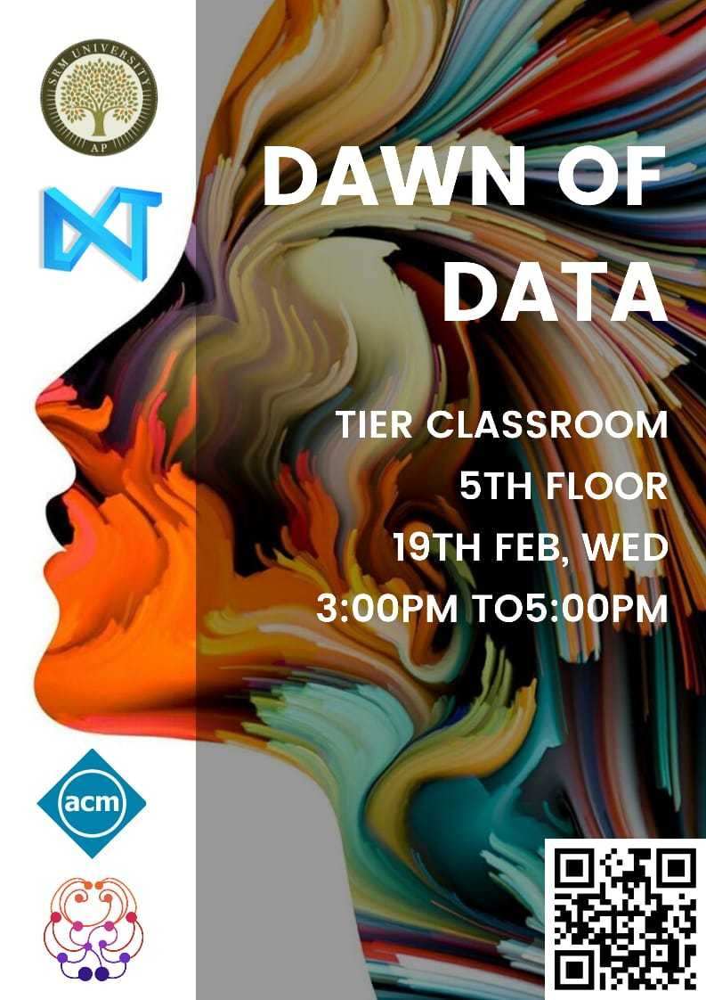

# Dawn of Data

Inaugral event of AP chapter of
[SRM Machine Intelligence Community](https://srm-mic.in/) (SRM MIC)

Dawn of Data is the first in a series of events geared towards introducing,
exploring, and analyzing the vast amounts of data around us. It aims to
acquaint attendees with basic working knowledge of the tools of trade in Data
Science, with the broader goal to motivate them towards an understanding of
Machine Intelligence.

